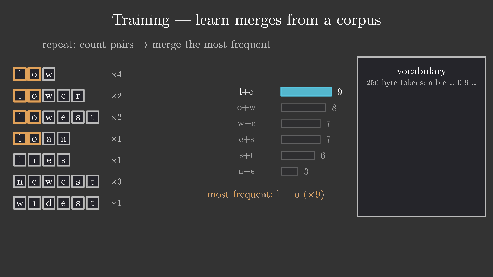
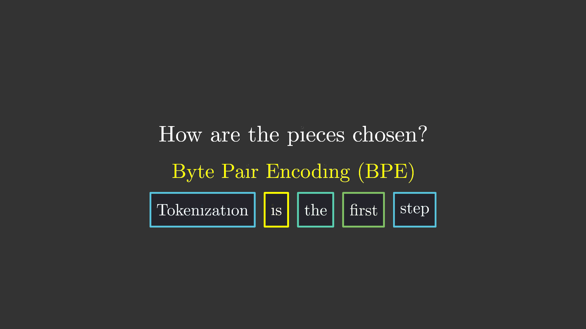
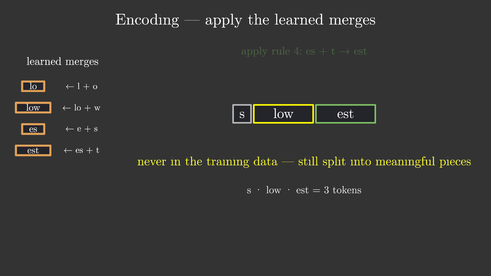

# bpe_tokenizer — LLM 如何读文本：Byte Pair Encoding 讲解视频

> **归档信息**：本 example 已从 ranim 仓库 `examples/agents/` 迁入
> ranim-one-shot 冻结仓库，`Cargo.toml` 将 ranim 钉定在
> `09d67d0f456c3124cc4e466f407369800f490845`。以下原始记录写于 ranim 仓库
> 时期，命令中的路径按当时环境理解；在本仓库渲染的命令见根 README。

## 1. 效果图



上图 `t = 54.9s`（merge 1 宣布获胜对的时刻）的 capture：左侧小语料已按字符
切块并高亮获胜对 `l+o`，中间是真实的相邻对计数条形图（`l+o ×9` 为唯一最大
值），右侧词汇表面板即将加入第一个合并 token。来源：

```bash
ranim output bpe_tokenizer --example bpe_tokenizer --features typst
```

产物 `output/agents/bpe_tokenizer/bpe_tokenizer_1920x1080_60/preview.png`
（scene 中 `r.insert_time_mark(MERGE_T0 + WINNER_AT + 1.2,
TimeMark::Capture("preview.png".to_string()))` 生成），原样复制到本目录。
另附两张 capture：

-  `t = 15s`：开场 hook 的提问卡（主标题已让位）；
-  `t = 125.8s`：未见过词 `slowest` 被学到的规则切成
  `s | low | est` 的收尾画面。

## 2. 原始 Prompt

> 创建一个 worktree 并准备实现一个 one shot example。
>
> 此 example 的主题是 LLM 的 tokenizer 相关的 BPE 算法的讲解，视频应该合理
> 地按照叙事、讲解逻辑进行划分，面向具备基础计算机素养但是对该算法没有任何
> 了解的人群。
> 你需要自己整理相关知识、设计讲解逻辑与叙事思路、构思视频段落与分镜、动画
> 构成，产出一个完整的科普视频成品。

无附件。

## 3. 设计与实现思路

### 知识整理与叙事设计

面向零基础观众的叙事弧线：**钩子 → 两难 → 算法 → 验证 → 意义**，全片
157 s（1080p60），单场景四幕：

1. **Hook（0–16.6 s）**：LLM 从不逐字母读文本——`Tokenization is the first
   step` 一句被切成 token 色块，抛出问题"这些块是怎么选的？"
2. **两个极端（17.6–42 s）**：按字符切 → 词汇表极小但序列极长（长序列 =
   昂贵的注意力）；按词切 → 序列短但词汇表爆炸（50 万+ 词条），且
   `newset` 这类没见过的词无法编码。谱线游标滑向中间：subwords。
3. **训练（43–107 s）**：在一个 7 词迷你语料上完整演示 BPE 循环——拆字符
   → 数相邻对 → 合并最高频对 → 重复。四个 merge 各 13 s
   （`l+o→lo`、`lo+w→low`、`e+s→es`、`es+t→est`），最后 "再来 5 万次" 收束
   到真实规模（GPT-2：256 字节 + 50,000 次合并 = 50,257 个 token）。
4. **编码与意义（108.6–157 s）**：把学到的 4 条规则应用到训练数据中没有的
   词 `slowest`，得到 `s | low | est`（泛化验证）；然后是三个真实后果卡片
   （strawberry 数 r 难、数字被分块、生僻文字/emoji 消耗更多 token）与一句
   话总结。

**语料是精心构造的**：`low×4, lower×2, lowest×2, loan×1, lies×1, newest×3,
widest×1`。逐对验证过每一步的最高频对都是唯一最大值（无平局），且四个
merge 依次是有语义的 `lo / low / es / est`，二级合并（`es+t→est`）能展示
"合并后的 token 继续参与后续合并" 这一 BPE 的核心复合性质。

**屏幕上所有数字都是真的**：`lib.rs` 内置一份 BPE 实现（`count_pairs` /
`merge_all` / `training` / `encode`），条形图计数、每阶段词行 token、
`slowest` 的编码阶段全部由它实时计算，没有手写动画数字。

### 关键实现路径

- 结构沿用 `examples/agents/convolution_kernels` 的模式：单 `#[scene]`，一
  个共享 `AnimStack`，每个物件组拥有完整生命周期的 `AnimSequence`
  （`life_seq`：fade in → 可选 recolor 事件（`morph_to` 换色）→ fade out →
  hold 到片尾），幕与幕之间以整幕淡出衔接。
- **token 芯片**：`chip_sized` = 深色填充矩形 + `TextItem` 字形。字形按
  baseline 定位（`TextItem` 条目的局部原点即基线，配合 `top-edge: 1em` 的
  em 盒），使单字母网格行视觉对齐；词级芯片用 ink 盒居中。学到的 token 按
  merge 着色（蓝/黄/青/绿），普通字符灰色。
- **配对高亮**：`chip_row` 返回每个 token 占用的 item 区间，获胜对只重着色
  盒子描边（`hilite_pair_paint`），字形不动。
- **计数条形图 / 词汇表面板 / 规则面板**：均由预计算的阶段数据
  （`Stage { rows, cands, winner }`）驱动，每次 merge 一张图、一行词条
  （`#256`…`#259`）。
- **文字渲染**：`typst` feature 的 `TextItem`（逐字形 VItem）。注意 typst
  markup 中的特殊字符：`~` 是不换行空格（显示 `~100` 需写 `\~100`），`#`
  进入代码模式（`\#256`）。
- 输出：`#[output(dir = "./output/agents/bpe_tokenizer")]`，1920×1080@60，
  157 s（9420 帧）；4 个 `TimeMark::Capture`（hook / preview / slowest /
  recap）。

## 4. 迭代过程（ranim-cli 工具使用记录）

### 第 1 轮

- 命令：
  ```bash
  cargo check -p ranim --example bpe_tokenizer --features typst
  ```
- 观察：2 个编译错误（`life_seq` 期望 `&mut Vec<VItem>` 传成了
  `&mut VItem`；一处多余 `mut`）+ 1 个 unused variable 警告。
- 修改：面板包进 `vec![]`；删多余 `mut`；`_count` 前缀。
- 结论：`cargo check` 通过。

### 第 2 轮

- 命令：
  ```bash
  ranim inspect scenes --example bpe_tokenizer --features typst
  ranim inspect tree bpe_tokenizer --example bpe_tokenizer --features typst
  ranim inspect frame bpe_tokenizer --at 55 ...
  ranim render bpe_tokenizer --example bpe_tokenizer --features typst
  ```
- 观察：scene 与 `#[output]` 摘要正确，动画树总时长 157 s；t=55 帧内物件
  数量与几何摘要符合预期。首次完整渲染（9420 帧，RTX 4070 Ti SUPER 约
  44–56 s）后抽帧逐张目检（t = 8/15/20/28/36.5/45/48/54.5/58/100/105/113/
  121/126/135/151），发现 7 个问题：
  1. act0 提问卡与主标题重叠（标题未让位）；
  2. act1 谱线游标圆点没有淡出，从 act1 一直残留到片尾（多个帧中央的白点）；
  3. 获胜对高亮把金色描边同时打到字形上，小盒子里糊成橙色团；
  4. act3 规则闪灯同样糊掉整行；
  5. typst markup 吞掉 `~` 与 `#`（"~100" 显示成 "100"，"#256" 丢 "#"）；
  6. 三条字幕超出画幅左缘被裁切；
  7. act1 词表列没有面板背景且 "500,000+" 徽章 y 坐标符号写反（跑到句子上
     方），面板顶边压住统计文字。
- 修改：标题/副标题在 11.2 s 让位；游标改为 fade in → 滑动 →
  `FadeOut`（用滑动终点状态的克隆做 FadeOut 源，避免跳回起点）；高亮/闪灯
  只重着色盒子 item（每个 token 区间的第 0 个）；`~`/`#` 转义；字幕缩短并
  重定位；act1 统计行统一上移、加面板、修正徽章 y；全局描边 `GREY_D`→
  `GREY_B` 提升对比度。
- 结论：重渲染后复查上述时点，全部干净。

### 第 3 轮

- 命令：再次 `ranim render` + 抽帧目检（t = 13/22.8/30/45/55/113/126）。
- 观察：t=45 语料词行里 `low` 在训练开始前就佩戴了它的"学到的"黄色（
  `chip_row` 按 `token_color` 着色，对训练前的整词行不适用）。
- 修改：训练前词行改用 `chip_sized` + `PLAIN_STROKE` 显式构造。
- 结论：`ranim output` 最终渲染并处理 4 个 capture；clippy 仅剩的
  `type_complexity` 警告以 `type Paint` 别名消除；`cargo fmt` 通过。

### 第 4 轮（rebase 到 main 后重渲染）

- 命令：
  ```bash
  git rebase main
  ranim output bpe_tokenizer --example bpe_tokenizer --features typst
  ```
- 观察：rebase 干净无冲突。基点从 `8bd664c` 移到 `79e9949`，其间上游把
  `ranim-items` 的 SVG 解析迁移到 usvg 0.48（`vitem/svg.rs` 大改）并升级了
  一批依赖；重新渲染后抽帧复查 12 个时点（t = 8/15/22.8/30/45/55/58/100/
  113/126/135/151）。
- 观察/变化：字形改为实心渲染（此前为细描边观感），可读性更好；词汇表
  词条的 `\#256`…`\#259` 的 `#` 前缀在新管线中正确显示；其余布局、时序、
  配色与 rebase 前一致，无回归。已用新渲染产物刷新三张 capture 图。
- 结论：rebase 后成片正常，capture 已更新（amend 进同一提交）。

## 5. 验证情况

- 构建：`cargo check` / `cargo clippy -p ranim --example bpe_tokenizer
  --features typst`（nix develop 内）全部通过，无警告。
- 渲染：`ranim render` 三轮冒烟 + 最终 `ranim output`（1080p60，157 s，
  9420 帧）成功，mp4 位于
  `output/agents/bpe_tokenizer/bpe_tokenizer_1920x1080_60.mp4`，4 张
  capture PNG 已复制到本目录。
- 视觉检查：对 23 个关键时点抽帧目检，上述问题均已确认修复；成片无重叠、
  无裁切、无残留物。
- 环境备注：本机 PATH 无 ffmpeg，渲染时把 nix store 中现存的
  `ffmpeg-*-bin/bin`（或 `nix profile install nixpkgs#ffmpeg` 得到的）
  前置到 `PATH` 运行（`ranim-cli` 支持从 PATH 找 ffmpeg；不希望它下载
  80 MB 的 `./ffmpeg` 到仓库根目录时可沿用此法）。

## 6. 模型与 Harness 环境

| 项 | 值 |
|---|---|
| 生成日期 | 2026-08-27 |
| 生成方式 | one-shot（内部 3 轮渲染 + 视觉迭代） |
| 模型 | GLM-5.3-Flash（harness 自报名 `builtin:bigmodel-coding-plan/GLM-5.3-Flash`，请维护者核对） |
| Harness / Agent 环境 | ZCode CLI（模型与版本以 harness 实际请求记录为准） |
| 关键参数 | 未记录 |
