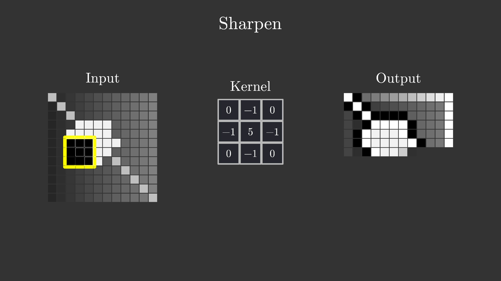
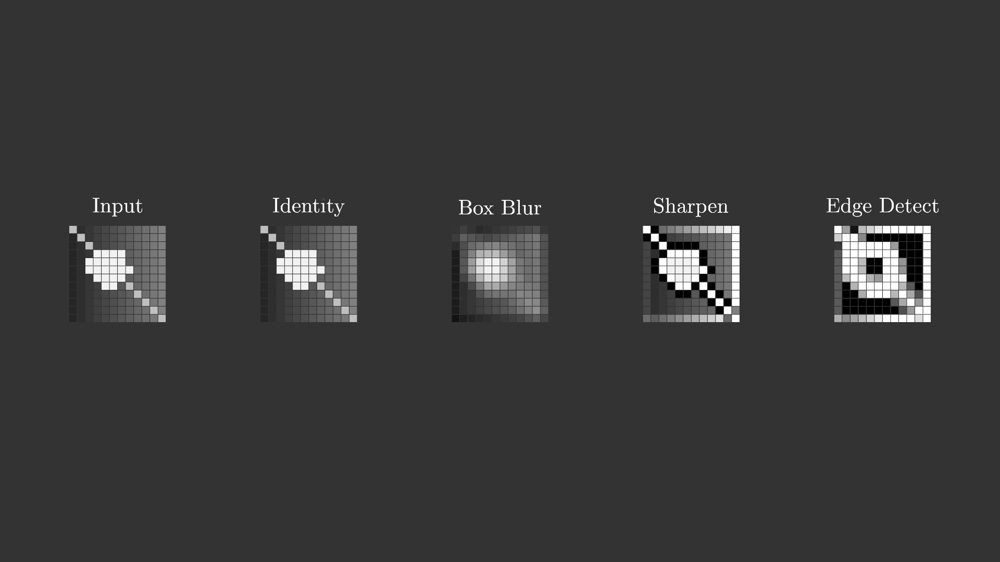

# convolution_kernels

> **归档信息**：本 example 已从 ranim 仓库 `examples/agents/` 迁入
> ranim-one-shot 冻结仓库，`Cargo.toml` 将 ranim 钉定在
> `09d67d0f456c3124cc4e466f407369800f490845`。以下原始记录写于 ranim 仓库
> 时期，命令中的路径按当时环境理解；在本仓库渲染的命令见根 README。

## 效果图

Sharpen 卷积扫描中途（左侧输入、中间 3x3 卷积核、右侧逐像素生成的输出，
黄色方框为当前滑动窗口位置）：

结尾总结：输入与四种卷积核结果的对比：

两张图均来自 `ranim output --example convolution_kernels --features typst`
处理的 `TimeMark::Capture` 截图（scene 中分别在 22.088s 与 39.2903s 插入
`preview.png` / `summary.png` 两个 capture mark），产物路径为
`output/agents/convolution_kernels/convolution_kernels_1920x1080_60/`。

## 原始 Prompt

> 创建一个 example 来演示用几种常用卷积核对图像的卷积操作

## 设计与实现思路

演示几种常用 3x3 卷积核（Identity、Box Blur、Sharpen、Edge Detect）对图像
做滑动窗口卷积的过程与结果对比。

- **图像表示**：ranim 没有位图物件（`SvgItem` 解析时直接跳过
  `usvg::Node::Image`，见 `packages/ranim-items/src/vitem/svg.rs`），因此
  图像用 12x12 个灰度 `VItem` 方块组成的像素网格表示——这恰好也是卷积
  可视化的经典呈现方式。源图像是程序生成的：水平渐变作平滑基底，加一个
  亮圆盘和一条对角亮条作锐利特征，使平滑区域与边缘在四种核下的差异都
  可见。
- **卷积计算**：`convolve()` 做标准的 3x3 滑动窗口卷积，zero padding，
  结果 clamp 到 [0, 1]；Edge Detect（8 邻域 Laplacian）输出以 0 为中心，
  按常见展示方式取 |v|。zero padding 会在图像边界产生明显的边缘响应，
  Edge Detect 结果中整圈边框变亮即为该 padding 伪影，属忠实呈现而非
  渲染错误。
- **场景结构**（每帧三栏）：左侧输入网格，中间卷积核矩阵（9 个方框 +
  typst 文字数值），右侧输出网格。黄色 3x3 窗口在输入上按光栅顺序逐步
  滑动，对应的输出像素随窗口经过逐个淡入；每个核扫描完后短暂停留再切
  换下一个核。结尾淡出主视图，淡入一行五个缩略图（输入 + 四个结果）
  做总结对比。
- **时间轴**：沿用 `examples/agents/rubiks_cube` 的模式，每个物件一条
  `AnimSequence`，用 `forward_to` / `hold_to` 对齐到共享时钟，最后全部
  压入一个 `AnimStack`。滑动窗口是自定义 `Eval`（`ScanWindow`），按
  `floor(alpha * n^2)` 吸附到像素格（参考 rubiks_cube 的 `CubieTurn`）。
- **文字**：标题、栏目名与卷积核数值用 `TextItem`（typst feature）渲染，
  转 `Vec<VItem>` 后逐字形 lagged 淡入淡出。
- **输出规格**：`#[output(dir = "./output/agents/convolution_kernels")]`，
  默认 1920x1080 @60fps mp4，总时长约 39.3s（intro 1.2s + 4 个核各
  8.36s + 总结约 4.7s）。

## 迭代过程（ranim-cli 工具使用记录）

one-shot，无修正轮次，最终代码即第 1 版。交付前经过以下验证（均为实际
执行）：

- `cargo check -p ranim --example convolution_kernels --features typst`：
  编译通过。
- `ranim inspect scenes --example convolution_kernels --features typst`：
  确认 scene 注册与 1920x1080 @60fps mp4 输出配置。
- `ranim inspect tree convolution_kernels --example convolution_kernels --features typst`：
  确认动画树结构与总时长 39.2903s、两个 capture time mark（22.088s /
  39.2903s）。
- `ranim inspect frame convolution_kernels --at <t> ...`（t = 1.0 / 3.0 /
  22.088 / 39.29）：确认各时刻物件数量（171 / 210 / 611 / 1603）与输入
  网格的灰度几何摘要符合预期。
- `ranim render convolution_kernels --example convolution_kernels --features typst`：
  冒烟渲染 2359 帧用时约 16.6s；用 ffmpeg 从 mp4 抽取 10 个关键时刻的
  帧（0.8 / 2.5 / 5.0 / 11.0 / 13.5 / 22.088 / 30.0 / 35.2 / 37.0 /
  39.2s）逐张视觉检查：四个核的扫描过程、输出逐像素生成、核间切换与
  总结转场均正确，未发现需要修改的问题。
- `ranim output --example convolution_kernels --features typst`：最终
  验证，渲染成片并保存两张 capture 截图，视觉确认后复制为本目录的
  `preview.png` 与 `summary.png`。

## 验证情况

已构建、已渲染并视觉检查（命令与产物见上节）。最终产物：
`output/agents/convolution_kernels/convolution_kernels_1920x1080_60/convolution_kernels_1920x1080_60.mp4`
（1920x1080 @60fps，39.29s）及 `preview.png`、`summary.png` 截图。
未发现问题。

## 模型与 Harness 环境

| 项 | 值 |
|---|---|
| 生成日期 | 2026-08-19 |
| 生成方式 | one-shot（内部 1 轮视觉验证，无修正） |
| 模型 | Kimi K3 |
| Harness / Agent 环境 | kimi-code CLI 0.36.1 |
| 关键参数 | 未记录 |
