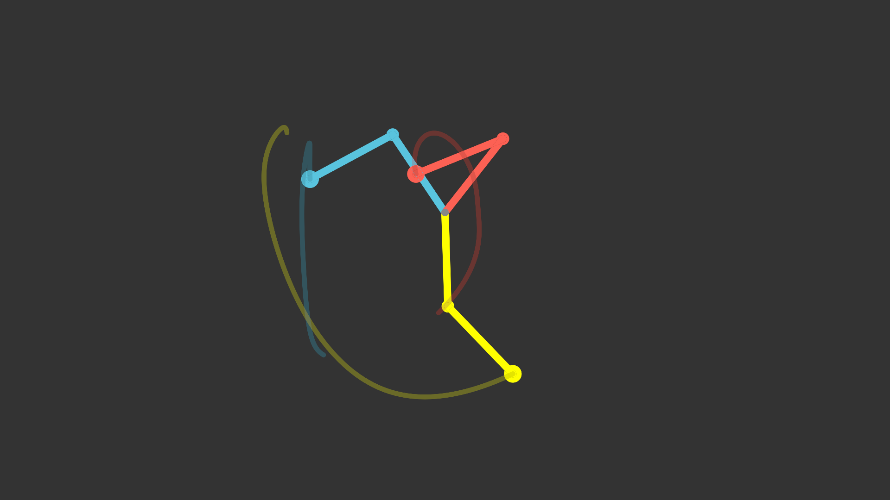

# double_pendulum — 双摆与混沌原理

> **归档信息**：本 example 已从 ranim 仓库 `examples/agents/` 迁入
> ranim-one-shot 冻结仓库，`Cargo.toml` 将 ranim 钉定在
> `09d67d0f456c3124cc4e466f407369800f490845`。以下原始记录写于 ranim 仓库
> 时期，命令中的路径按当时环境理解；在本仓库渲染的命令见根 README。

## 1. 效果图



上图为 `t = 24s`（场景最后一帧）的 capture：三个初始条件仅相差 0.001 rad
的双摆此时已处于完全不同的状态。来源：

```bash
ranim output double_pendulum --example double_pendulum   # 实际以 cargo run -p ranim-cli -- 运行
```

产物 `output/agents/double_pendulum/double_pendulum_1920x1080_60/preview.png`
（scene 中 `r.insert_time_mark(24.0, TimeMark::Capture("preview.png".to_string()))`
生成），原样复制到本目录。

## 2. 原始 Prompt

> 在 examples/agents 下实现一个 example 来演示混沌原理。

无附件。

## 3. 设计与实现思路

- **演示内容**：确定性混沌的核心特征——对初始条件的敏感依赖。三个完全相同的
  平面双摆（点质量 + 无质量杆）从静止释放，仅第二杆初始角相差 `EPSILON =
  0.001 rad ≈ 0.057°`。前几秒三者完全重叠、无法区分；微小差异被指数放大，
  约 6–8 s 后轨迹彻底分离。方程是确定性的，长期行为却不可预测。
- **场景结构**：单场景 `double_pendulum`，时长 24 s。相机静止展示 +
  一个 `Iterative` 动画推进物理状态，模式与 `examples/nbody` 一致：
  闭包按 `sim_secs * delta_alpha` 推进物理时间，`Extract` 每帧把杆、摆球和
  拖尾投影成 `VItem`。
- **物理实现**：标准双摆方程（L1=L2=1.5，M1=M2=1，g=9.8），RK4 积分，
  子步长 ≤ 1/240 s 保证长时间数值稳定。悬挂点 `(0, 0.6)`，最大摆幅 3.0，
  全程在 8×(16/9) 画幅内。
- **视觉元素**（按提取顺序，即 z-order）：每摆一条末端拖尾折线
  （`VItem::from_vpoints`，anchor–midpoint–anchor 二次 vpoint 三元组，
  透明度 0.35，约 1.25 s 历史）→ 两节杆（`Line`，线宽 0.06）→ 两个摆球
  （`Circle`）→ 顶部悬挂点灰点。三摆配色 manim 蓝/黄/红，重叠期只看到最后
  绘制的红色，分离后三色各自清晰。
- **关键取舍**：不用文字标注（避免 typst feature 依赖），让"重叠 → 分离"
  本身讲故事；拖尾用折线而非 nbody 的离散点，更能表现混沌轨迹的连续性。
- **输出规格**：`#[output(dir = "./output/agents/double_pendulum")]`，
  默认 1920×1080 @ 60 fps mp4，24 s（1440 帧）。

## 4. 迭代过程（ranim-cli 工具使用记录）

### 第 1 轮

- 命令：
  ```bash
  cargo check -p ranim --example double_pendulum
  ```
- 观察：7 个编译错误：`ChaosState` 未实现 `Clone`（`Iterative` 要求），
  `std::array::from_fn` 在 RK4 中数组长度推断失败（E0284）。
- 修改：为 `ChaosState` 加 `#[derive(Clone)]`；`from_fn` 改为显式
  `std::array::from_fn::<f64, 4, _>(...)`。
- 结论：`cargo check` 通过。

### 第 2 轮

- 命令：
  ```bash
  ranim inspect scenes --example double_pendulum
  ranim inspect tree double_pendulum --example double_pendulum
  ranim inspect frame double_pendulum --at 1 --example double_pendulum
  ranim inspect frame double_pendulum --at 20 --example double_pendulum
  ```
  （均实际以 `cargo run -p ranim-cli -- ...` 运行；首次运行构建了 ranim-cli。）
- 观察：scene 注册正确（1920x1080 @60fps mp4 →
  `./output/agents/double_pendulum`）；动画树为 Static(camera) + Iterative，
  均为 [0..24]、enabled；`--at 1` 时三条拖尾 AABB 几乎相同（三者重叠），
  `--at 20` 时三条拖尾 AABB 完全不同（已分离）；帧内物件为 camera + 16 个
  vitem（3 拖尾 + 6 杆 + 6 摆球 + 1 悬挂点），颜色与 z-order 符合设计。
- 结论：结构与时间轴正确，进入渲染。

### 第 3 轮（ranim-cli 渲染路径故障排查与修复）

- 命令：
  ```bash
  ranim output double_pendulum --example double_pendulum
  ```
- 观察：进程在打印 `Output: ...` 后静默退出，无产物。`ranim render nbody
  --example nbody` 同样失败——与具体 scene 无关。真实退出码 139（SIGSEGV，
  此前 `| tail` 管道掩盖了退出码）。
- 定位：strace 显示 CLI 把 `libnbody.so` 复制到 /tmp 并 dlopen 后，
  主线程在打印 render 日志前已 `munmap` 整个 dylib；随后调用
  `Scene::constructor`（指向 dylib 的函数指针）跳到已解除映射的地址崩溃。
  根因：`packages/ranim-cli/src/cli/render.rs` 的 `load_scenes` 中
  `load_user_library(args)?.scenes().collect()` 在语句结束时 drop 掉
  `RanimUserLibrary`（dlclose），而 `Scene` 里的函数指针仍指向该 dylib
  ——use-after-free。`inspect` 命令因 `let lib = ...` 持有库而未触发。
- 修改：`load_scenes` 改为返回 `(RanimUserLibrary, Vec<Scene>)`，
  `output_command` / `render_command` 以 `let (_lib, all_scenes) = ...`
  持有库至渲染结束，并注释说明存活要求。
- 结论：重跑 `ranim output` 成功——1440 帧 8.5 s 渲染完成（NVIDIA
  RTX 4070 Ti SUPER / Vulkan），产出 mp4 与 capture。

### 第 4 轮（视觉检查）

- 命令：
  ```bash
  ffmpeg -ss <t> -i output/agents/double_pendulum/double_pendulum_1920x1080_60.mp4 -frames:v 1 /tmp/dp_t<t>.png  # t = 2, 8, 16
  ```
  并用读图能力查看三张抽帧与 capture 图 `preview.png`（t=24）。
- 观察：t=2 三摆重叠为一体（只见红色与混合拖尾）；t=8 三者完全分离、
  拖尾各异；t=16 与 t=24 位置、轨迹完全不同。构图居中、全程在画幅内。
- 结论：视觉效果满足"演示混沌原理"的 prompt，无需再改代码。

## 5. 验证情况

- `cargo check -p ranim --example double_pendulum`：通过。
- `ranim inspect scenes / tree / frame --at 1,20`：scene 注册、时间轴、
  物件构成、z-order、重叠→分离的 AABB 变化均符合预期。
- `ranim output double_pendulum --example double_pendulum`：成功渲染
  1440 帧，产物：
  - `output/agents/double_pendulum/double_pendulum_1920x1080_60.mp4`
  - `output/agents/double_pendulum/double_pendulum_1920x1080_60/preview.png`
- 视觉检查：抽帧 t=2/8/16 与 capture t=24 均人工读图确认（见第 4 轮）。
- 已知限制：首次视觉检查中曾用单条 ffmpeg 命令连抽三帧导致输出同一张图，
  改为逐条命令后正常；与 example 代码无关。

## 6. 模型与 Harness 环境

| 项 | 值 |
|---|---|
| 生成日期 | 2026-08-18 |
| 生成方式 | one-shot（内部 4 轮迭代，含 1 次 ranim-cli 渲染路径 bug 修复；lib.rs 视觉一轮通过） |
| 模型 | Kimi K3 |
| Harness / Agent 环境 | Kimi Code CLI，具体版本未记录 |
| 关键参数 | 未记录 |
