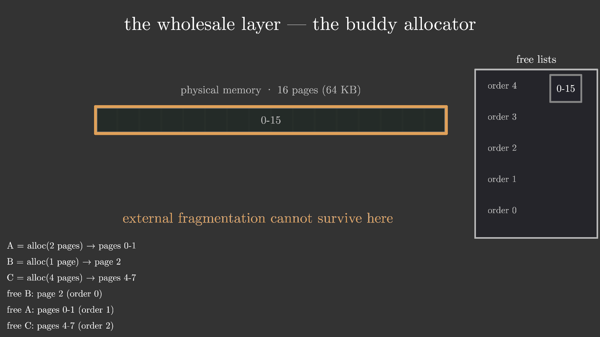
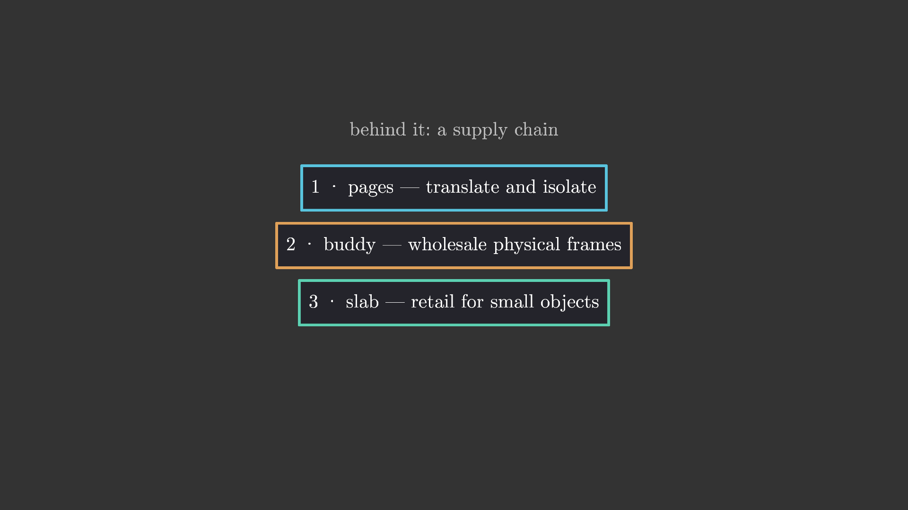
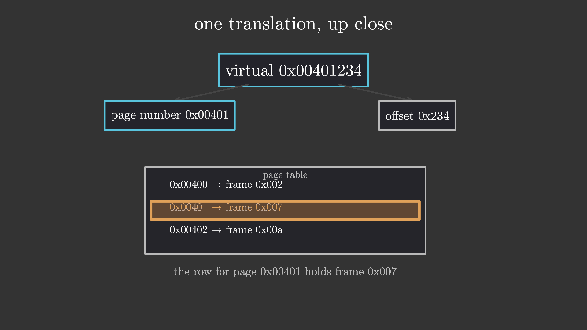
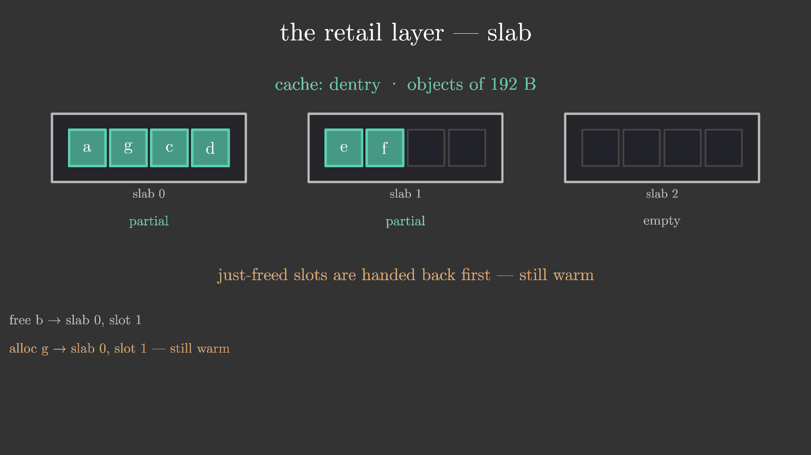
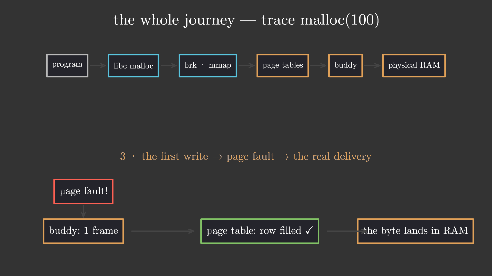

# linux_mem_alloc — Where Does Memory Come From? 讲解视频

> **归档信息**:本 example 由 one-shot 流程产出于 `linux-mem-glm53flash`
> worktree,`Cargo.toml` 将 ranim 钉定在
> `09d67d0f456c3124cc4e466f407369800f490845`(与 bpe_tokenizer 同一 pin)。
> 渲染命令见文末与根 README。

## 1. 效果图



上图 `t = 201s`:伙伴系统收尾时刻 —— 释放 C 触发两级合并,16 页竞技场
变回完整的 order-4 块(金色脉冲强调),"外部碎片在这里活不下来"。
左下操作日志与右侧空闲链表均由文件内置的真实 buddy 分配器模拟驱动。
来源:

```bash
ranim output linux_mem_alloc --example linux_mem_alloc --features ranim/typst
```

产物 `output/linux_mem_alloc/linux_mem_alloc_1920x1080_60/preview.png`
(scene 中 `r.insert_time_mark(201.0, TimeMark::Capture(...))` 生成)。
另附四张 capture:

-  `t = 17.8s`:开场钩子的"供应链"目录
  (pages / buddy / slab 三层预告);
-  `t = 86.5s`:一次虚拟地址翻译的特写
  (`0x00401234` → 页号 0x00401 + 页内偏移 0x234 → 查表 → `0x007234`);
-  `t = 251.5s`:slab 热槽位复用 —— 刚释放的 dentry
  槽位被下一个对象立刻拿走(金色描边脉冲);
-  `t = 314.6s`:完整旅程第三步 —— 第一次写入
  触发缺页,伙伴系统交出物理页,页表登记,字节真正落进 RAM。

## 2. 原始 Prompt

> 创建一个名为 linux-mem-glm53flash 的 worktree 并准备实现一个 one shot
> example。
>
> 此 example 的主题是 Linux 底层的内存分配机制的动画,要详细包含段页分配、
> 伙伴系统、slab 等等内容,时长不做限制,以内容为中心。
> 视频应该合理地按照叙事、讲解逻辑进行划分,并对关键内容精心设计讲解动画,
> 面向具备基础计算机素养但是对相关内容没有任何了解的人群。
> 你需要自己整理相关知识、设计讲解逻辑与叙事思路、构思视频段落与分镜、
> 动画构成,产出一个完整的科普视频成品。

无附件。

## 3. 设计与实现思路

### 知识整理与叙事设计

面向零基础观众的叙事弧线:**钩子 → 虚构的地址空间 → 段的失败 → 页的胜利
→ 物理页的批发(伙伴)→ 内核对象的零售(slab)→ 完整供应链回放**。
全片 343 s(5:43,1080p60),单场景五幕:

1. **Hook(0–20 s)**:`buf = malloc(100)` 换回一个指针,抛出问题
   "这些字节到底是谁找到的?";建立心智模型 —— 内存 = 带编号的字节大数组,
   分配 = 找一段空着的、登记、交回首地址;以三张卡片预告全片结构
   (pages / buddy / slab)。
2. **从段到页(21.4–119.4 s)**:每个进程都被告知拥有整个地址空间(谎言);
   方案一 段(base+limit,含一次逐位计算的真实翻译演示)→ 外部碎片
   (由内置的 first-fit 分配器真实计算:256 KB 竞技场上 A/B/C/D 填满、
   释放 B/D 留出 64+32+32 KB,请求 80 KB 失败)→ 方案二 页(4 KB 固定
   粒度、乱序映射任意空闲页框、两个进程各自的页表实现隔离)→ 一次翻译
   特写(地址拆位、查表、拼回)→ 多级页表(2^20 行 × 4 B = 4 MiB/进程
   的账本成本,树形结构只建用到的子树;x86-64 4 级 × 9 位 + 12 = 48 位、
   每张表 512 × 8 B 恰好一页,均由常量推导)→ TLB、大页、内部碎片一句带过。
3. **伙伴系统(120.8–218.4 s)**:页表需要真实页框 —— 谁来找?
   16 页(64 KB)竞技场、order 0–4 空闲链表;分配级联(alloc order-1 触发
   三级分裂,右半逐级入链表);`buddy(p) = p ^ 2^k`(含二进制示例);
   释放级联(free B 合并一次、free A 合并一次、free C 两级合并直回
   order-4 整块,金色脉冲收尾);短板:最小批发单位是一整页,
   装 192 B 的 dentry 浪费 95%。
4. **slab(219.8–295.4 s)**:内核高频生死的小对象;每类一个 kmem_cache,
   slab = 整页切成等大槽位(full / partial / empty 三状态);
   分配/释放循环动画由内置 slab 模拟驱动 —— 刚释放的槽位立刻被复用
   (热槽位金色脉冲);kmalloc 尺寸档尺子(32…8K,100 B 向上取整到 128);
   现实面板:/proc/slabinfo 中真实存在的缓存名(task_struct、dentry、
   ext4_inode_cache…),slabtop 一句;1994 年 SunOS 起源与 SLUB 现状。
5. **完整旅程(296.8–343 s)**:六站供应链图(program → libc malloc →
   brk·mmap → page tables → buddy → physical RAM);分三步追踪
   `malloc(100)`:libc 自己的库存切 112 B(内核无感)→ 库存不足时 mmap
   只在纸面上扩张地址空间 → 第一次写入触发缺页,伙伴交页、页表登记、
   字节落进 RAM;点题 demand paging;三张回顾卡与结束语。

**屏幕上所有数字都是真的**:文件内置四套真实实现
(`seg_first_fit` 首适应分配器、地址翻译与页表尺寸常量推导、
`buddy_sim` 完整伙伴分配器(带 Split/Grant/ListAdd/Merge 事件日志)、
`slab_sim` 槽位状态机(带 reused 标记)),动画时间线由模拟输出的事件
序列驱动,没有任何手写动画数字。`cargo test` 对四套实现的全部关键
断言(碎片失败、翻译结果、级联事件序列、最终回归整块、热槽位复用)
进行验证。

### 关键实现路径

- 结构沿用 `bpe_tokenizer`:单 `#[scene]`,一个共享 `AnimStack`,
  每个物件组拥有完整生命周期的 `AnimSequence`(`life_seq`:fade in →
  morph 事件(重着色/位移)→ fade out → hold 到片尾),幕与幕之间整幕淡出。
- **伙伴系统是数据驱动的**:walk `buddy_sim` 的输出,为每个块维护
  `BlkLife { in_t, out_t, grant, freed, consumed }`,为每个链表芯片维护
  `ChipLife`;Split/Merge/Grant/ListAdd 四类事件映射为矩形分裂、芯片
  出入链表、着色与改名。查找只看未 `consumed` 的块,避免同名 key
  (如两个 `(2,1)`)遮蔽。
- 内存条与块:`cell_row` 画格子、`span_rect` 按页跨度画矩形;
  链表行 `fl_row_y(order)` 与条带几何解耦。
- 箭头为手搓三线开放式(`arrow_items`:主轴 + 两条翼线),因为本 pin 的
  ranim 未启用 `arrow` 模块。
- 文字渲染:typst feature 的 `TextItem`(逐字形 VItem)。注意 typst
  markup 的坑:`_` 会触发强调(所有 `task_struct` 类名字必须写成
  `task\\_struct`),`#`/`~` 需转义;em dash 前后留白较宽,卡片文案
  改用 `·`。
- 高亮只刷盒子不刷字形:chip 组的第 0 个 item 是方框,字形描边一旦
  加宽就会糊成色团(kmalloc 的 128 档、slab 热槽位均只改 `items[0]`)。
- 输出:`#[output(dir = "./output/linux_mem_alloc")]`,1920×1080@60,
  343 s(20580 帧);5 个 `TimeMark::Capture`。

## 4. 迭代过程(渲染 + 视觉检查记录)

每轮 `ranim render` 全片渲染(~5.3 min)后用 ffmpeg 抽帧逐张目检,
单轮抽检 15–30 个时点。

### 第 1 轮

- 发现 9 个问题:
  1. 段式 demo 中被释放的 B/D 块不消失(生命终点写成了整幕终点);
  2. 段式讲解字幕与 program A 面板重叠;
  3. "4 MiB of bookkeeping" 金色字幕超出左边界;
  4. 树形图字幕超出右边界;
  5. level 1/2 标签与树节点重叠;
  6. 伙伴条带(16×0.56)右缘压住空闲链表面板;
  7. 页式 beat 的 "physical memory" 标签被橙色映射箭头穿过;
  8. kmalloc 的 128 档高亮把字形描边也刷成金色,糊成色团;
  9. malloc 旅程阶梯图的箭头扎进相邻 chip(固定间距没考虑 chip 宽度)。
- 修复:释放块按 free 时刻淡出;字幕重定位;`BB_CELL` 0.56→0.52、
  `BB_X0` 左移;标签挪到条带下方;高亮只改 `items[0]`;阶梯图改为按
  实际文字宽度均分、箭头画在相邻边缘之间。

### 第 2 轮

- 渲染即 panic:`seg_first_fit` 的 E=80 分配失败返回 `None`,
  `step.start.unwrap()` 崩溃(首轮渲染时该分支尚不存在,第 1 轮
  修复释放块时引入)。改显式 match 失败分支后通过。

### 第 3 轮

- 抽帧发现伙伴系统"幽灵标签":已分裂/合并掉的父块标签残留在条带上
  (如 `0-7`、`0-3` 半透明不消失)。根因是 walker 用
  `blocks.iter().position(|b| b.key == key)` 查块,而 Merge 会推入与
  早死块同 key 的新块,查找到的是死块,`out_t` 被改写、旧块"复活";
  移除式修复又导致死块不渲染(条带在第 150 s 变空)。
- 终版方案:`BlkLife` 增加 `consumed` 标记 —— Split/Merge 消费块时置位
  (不再从 vec 移除,保留完整生命周期供渲染),所有查找过滤
  `!consumed`;Free 的簿记挪到事件循环之前(Merge 事件会消费被释放块)。
- 同时发现 slab 循环的 `cycle_t[i - 6]` 索引错位(Free 步骤也占索引),
  alloc g/h 的动画比日志晚 4 s 出现;改为按 S_OPS 步骤索引显式映射时间。
- 另修:单页块标签 `2-2` → `2`(条带与链表芯片两处)。

### 第 4 轮(终版)

- 全片抽检 16 个时点 + 5 张 capture,上述问题全部确认修复,无新问题;
  `ranim output` 出成片并处理 5 张 capture。

## 5. 验证情况

- 构建:`cargo check` / `cargo clippy --example linux_mem_alloc
  --features ranim/typst` 零警告;`cargo fmt` 通过。
- 测试:`cargo test --example linux_mem_alloc --features ranim/typst`
  5 个用例全部通过(段式碎片失败、页表翻译数学、伙伴级联事件序列、
  伙伴最终回归整块、slab 热槽位复用)。
- 渲染:4 轮全片渲染 + 终版 `ranim output`(1080p60,343 s,20580 帧)
  成功,mp4 位于 `output/linux_mem_alloc_1920x1080_60.mp4`,5 张
  capture PNG 已复制到本目录。
- 视觉检查:四轮共抽检 40+ 个时点,确认无重叠、无裁切、无残留物、
  无时序错位。
- 环境备注:渲染在根 flake 的 `nix develop` 内进行(ffmpeg 由 nix
  提供并自动出现在 PATH 中,无需 bpe 时代的 PATH 前置手工操作)。

## 6. 模型与 Harness 环境

| 项 | 值 |
|---|---|
| 生成日期 | 2026-09-15 |
| 生成方式 | one-shot(内部 4 轮全片渲染 + 视觉迭代) |
| 模型 | GLM-5.3-Flash(harness 自报名 `builtin:bigmodel-coding-plan/GLM-5.3-Flash`,请维护者核对) |
| Harness / Agent 环境 | ZCode CLI(worktree `linux-mem-glm53flash`) |
| 关键参数 | 未记录 |
