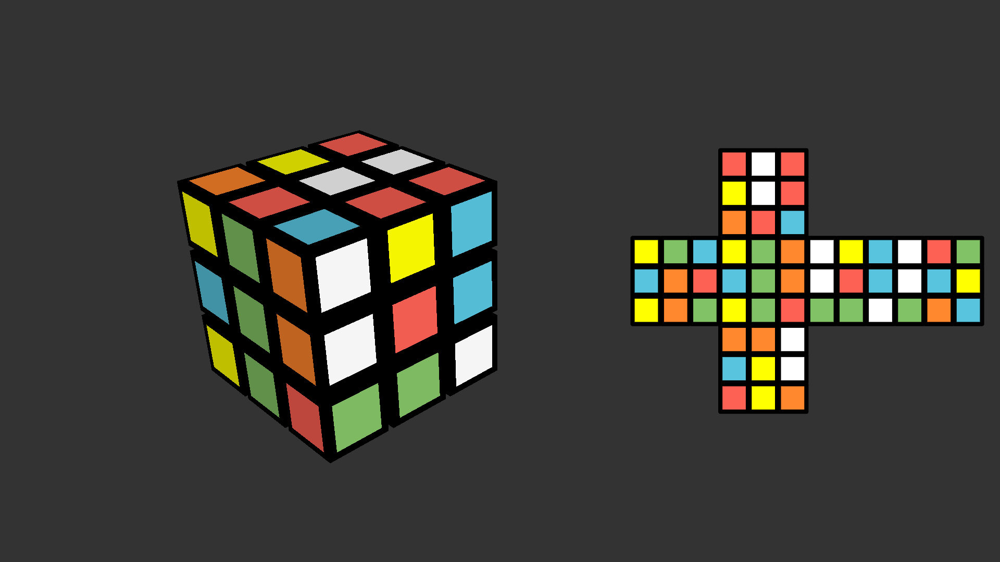
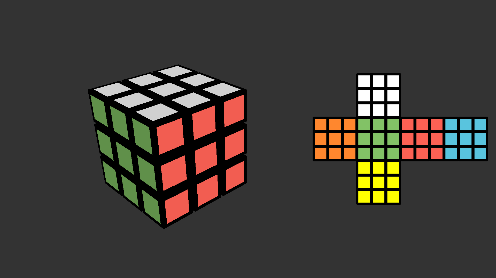

# rubiks_cube

> **归档信息**：本 example 已从 ranim 仓库 `examples/agents/` 迁入
> ranim-one-shot 冻结仓库，`Cargo.toml` 将 ranim 钉定在
> `09d67d0f456c3124cc4e466f407369800f490845`。以下原始记录写于 ranim 仓库
> 时期，命令中的路径按当时环境理解；在本仓库渲染的命令见根 README。

一个完整的三阶魔方「打乱 → 求解」过程：左侧是 3D 魔方（26 个 cubie 网格
模型），右侧是同步更新的平面展开图（net），12 步打乱后按逆序求解还原。

## 效果图

打乱完成时刻（t = 8.4 s），3D 魔方与展开图状态一致：



求解结束时刻（t = 17.52 s，视频结尾），魔方与展开图均回到还原态：



两张图均来自 `ranim output --example rubiks_cube` 渲染产物中的
`TimeMark::Capture` 截图（`output/agents/rubiks_cube/rubiks_cube_1920x1080_60/`
下的 `preview.png` 与 `solved.png`），分别对应 `lib.rs` 中
`r.insert_time_mark(scramble_end, ...)` 和 `r.insert_time_mark(total_secs, ...)`
两处标记。

## 原始 Prompt

> 创建一个 example 演示一个完整的魔方求解过程，要包括 3d 的魔方，以及平面展开图。

无附件。

## 设计与实现思路

- **3D 魔方**：26 个 cubie（跳过内核），每个 cubie 是一个 `MeshItem`，
  顶点合并了黑色本体（6 面）与略微凸出的彩色贴纸 quad（每朝外面一个，
  双面三角形避免背面剔除问题）；法线留空，走渲染器的 flat shading。
  配色采用标准西方配色：U 白 / R 红 / F 绿 / D 黄 / L 橙 / B 蓝。
- **面转动画**：每次转动是一个自定义 `Eval`（`CubieTurn`），把转动层
  9 个 cubie 的 `transform` 绕面轴（过原点）插值旋转 ±90°/180°，
  写法参考 `examples/tetrahedron_spheres` 的 `RotateAroundZ`；`apply_to`
  把末态写回 cubie，cubie 的逻辑格点坐标用同一套整数旋转公式同步更新。
- **平面展开图**：54 个 `VItem` 方块按十字布局（U 在上，L F R B 一排，
  D 在下）放置在**朝向相机的平面**内（平面基向量由相机 `facing` 与世界上
  方向叉积得到），位于画面右半。贴纸置换不查表：每个贴纸有 3D 格点位置与
  法向，转动时用与 cubie 完全相同的整数 Rodrigues 公式旋转再映射回
  (face, idx)，因此展开图与 3D 魔方在数学上不可能不一致。颜色变化的贴纸
  在每次转动的后 40% 时间里用 `MorphAnim` 切换填充色。
- **求解**：打乱序列由固定种子的 xorshift64 生成（12 步，不连续转同一
  面），求解 = 打乱序列的逆序取逆。这在数学上是真实解，且让 example 聚焦
  于动画而非求解器实现。
- **时间轴**：每个 cubie / 贴纸各持有一条 `AnimSequence`，每步转动对所有
  序列同步推进（层内 cubie `push` 转动动画、其余 `hold`），最后全部
  `push` 进一个 `AnimStack`；相机用 `cam.show().with_duration(total)`。
  时间轴：intro 1.2 s → 打乱 ~7.2 s → 停顿 1.0 s → 求解 ~6.1 s →
  结尾 2.0 s，共约 17.5 s。
- **输出规格**：默认 1920x1080 @60fps mp4，
  `#[output(dir = "./output/agents/rubiks_cube")]`。

## 迭代过程（ranim-cli 工具使用记录）

one-shot，无视觉修正轮次：第 1 版代码的视觉结果即满足 prompt，未发生
针对画面效果的修改。期间只清理了编译警告（未使用的面索引常量、无效的
`clock` 累加）。实际执行过的验证如下。

### 第 1 轮（也是唯一一轮）

- 命令：
  ```bash
  cargo check -p ranim --example rubiks_cube
  cargo run -p ranim-cli -- inspect scenes --example rubiks_cube
  cargo run -p ranim-cli -- inspect tree --example rubiks_cube
  cargo run -p ranim-cli -- inspect frame rubiks_cube --at 0.5 --example rubiks_cube
  cargo run -p ranim-cli -- inspect frame rubiks_cube --at 8.4 --example rubiks_cube
  cargo run -p ranim-cli -- inspect frame rubiks_cube --at 17.5 --example rubiks_cube
  ```
- 观察：编译通过；scene 注册成功（1920x1080@60 mp4，输出目录正确）；
  动画树总时长 17.52 s，`CubieTurn` 时间段与打乱（1.2–8.4 s）/求解
  （9.4–15.52 s）阶段吻合，两个 capture time mark 位置正确；frame 查询
  确认 t=0.5 时 cubie 位于初始格点、t=8.4 时已被打乱、t=17.5 时全部
  回到初始位置（AABB 与 t=0.5 一致，仅有浮点累积误差量级的差异）。
- 另用一个独立的 Python 脚本复算同一套整数旋转/置换逻辑，确认每步转动
  是 54 贴纸的双射、且「打乱 + 逆序取逆」严格回到还原态。
- 问题：无功能性问题；清理了 8 个编译警告。
- 修改：删除未使用的常量与死代码（不影响行为）。

### 冒烟渲染与视觉检查

- 命令：
  ```bash
  cargo run -p ranim-cli -- render rubiks_cube --example rubiks_cube
  ffmpeg -ss <t> -i output/rubiks_cube_1920x1080_60.mp4 -frames:v 1 frame_<t>.png
  ```
- 观察：用视觉能力读取 t = 0.5 / 3.0 / 8.4 / 12.0 / 17.4 五帧。
  t=0.5 为还原态（白顶、绿左、红右，展开图十字对应）；t=3.0 与 t=12.0
  可见一整层正在转动；t=8.4 为完全打乱态；t=17.4 回到还原态。
- 对照检查：t=8.4 帧中展开图各面贴纸与 Python 独立模拟的打乱结果逐格
  一致（如 U 面 = 红白红/黄白红/橙红蓝，F 面 = 黄绿橙/蓝绿橙/黄绿红）。
- 结论：满足 prompt，无需修正。

## 验证情况

- `cargo check -p ranim --example rubiks_cube`：通过，无警告（清理后）。
- `ranim inspect scenes / tree / frame`：结构、时长、物件数量（camera +
  26 mesh + 54 vitem）与关键时刻几何均符合预期。
- `ranim render rubiks_cube --example rubiks_cube`：冒烟渲染成功，抽 5 帧
  完成视觉检查（见上）。
- `ranim output --example rubiks_cube`：最终验证通过，1053 帧（17.52 s）
  在 RTX 4070 Ti SUPER 上约 6.5 s 渲染完成；产物
  `output/agents/rubiks_cube/rubiks_cube_1920x1080_60.mp4` 及两张
  capture 截图，截图已视觉确认并复制为本目录的 `preview.png` / `solved.png`。

## 模型与 Harness 环境

| 项 | 值 |
|---|---|
| 生成日期 | 2026-08-18 |
| 生成方式 | one-shot（内部 1 轮视觉迭代，无修正） |
| 模型 | Kimi K3 |
| Harness / Agent 环境 | Kimi Code CLI 0.36.1 |
| 关键参数 | 未记录 |
