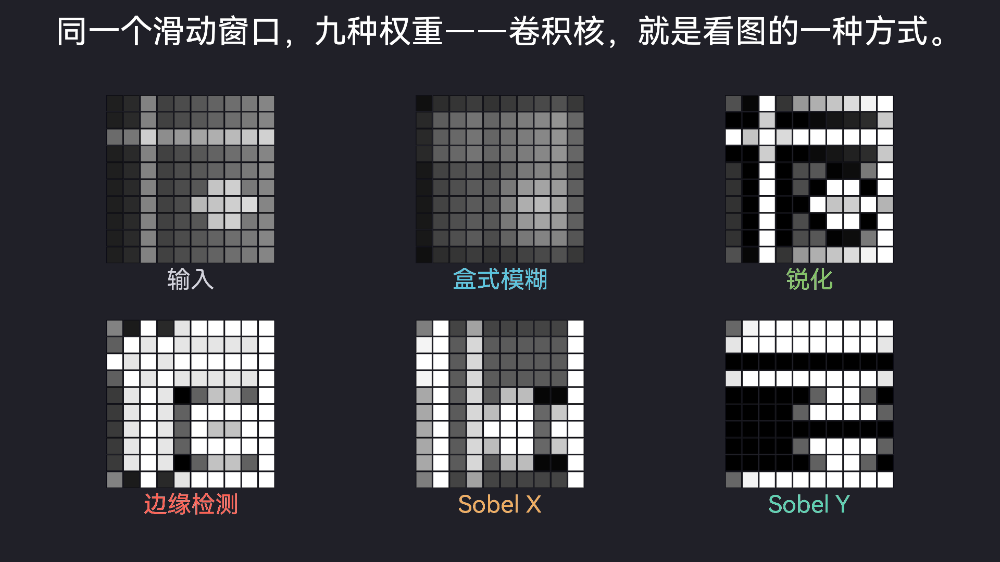
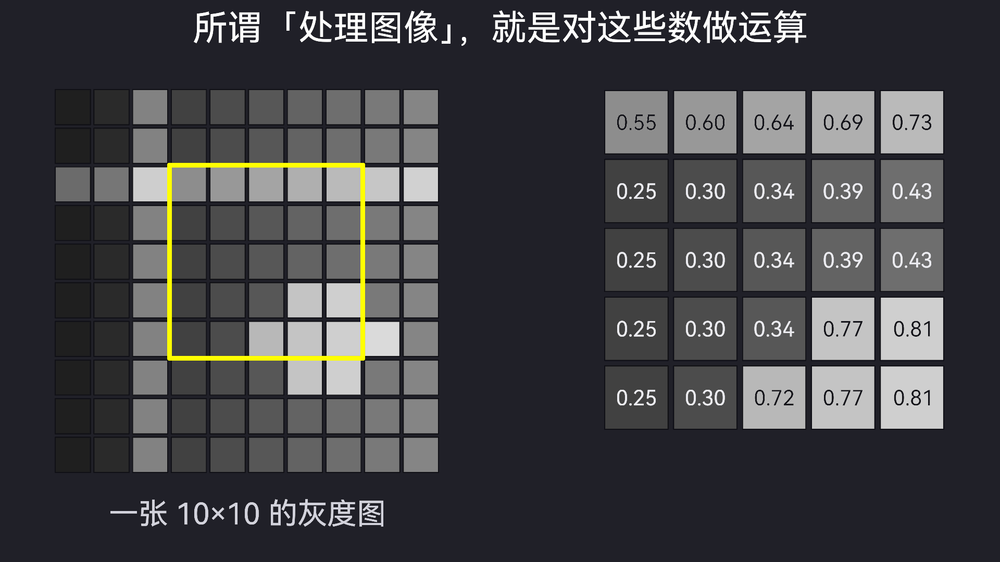
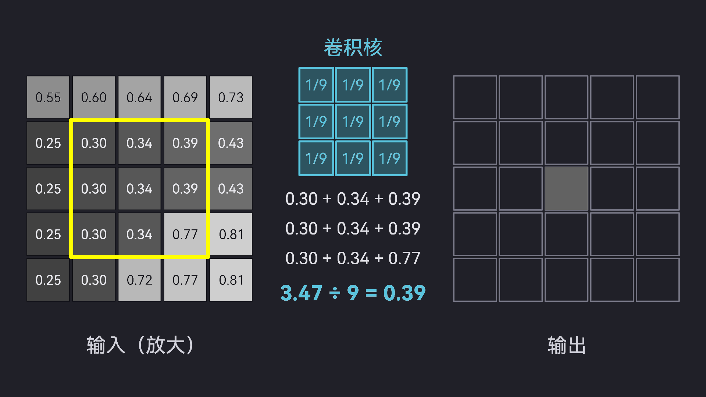
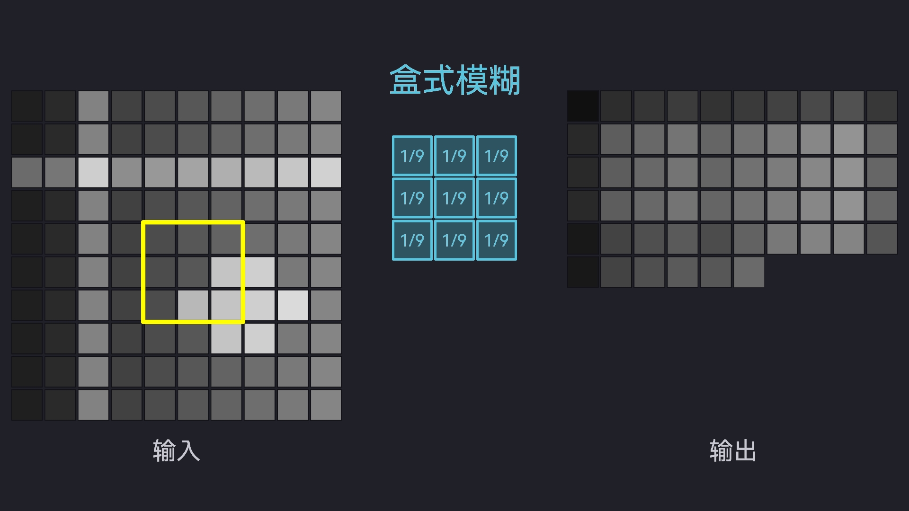
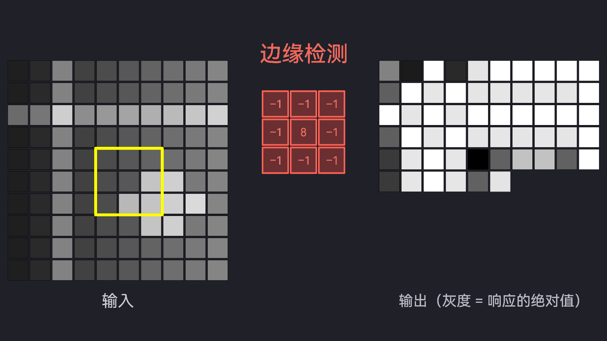
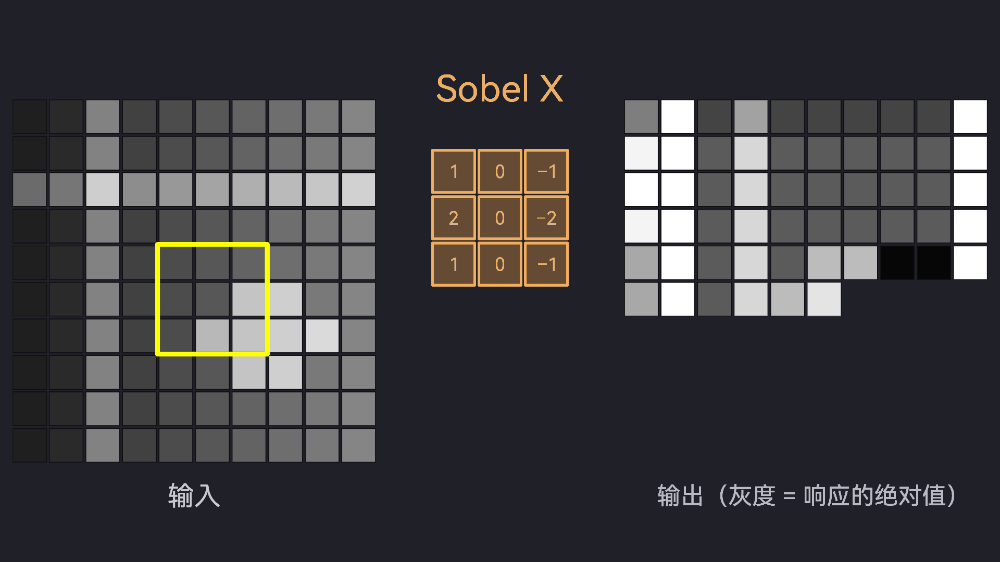
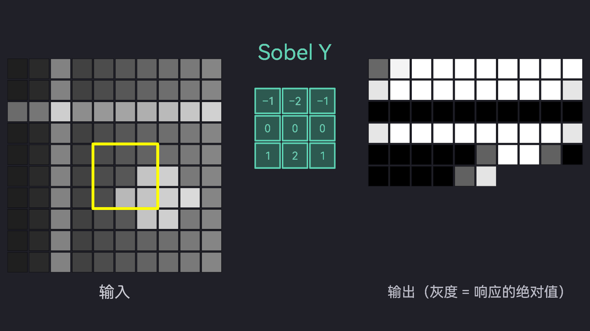

# convolution_kernels run1-glm53flash — 用五种常用卷积核演示图像卷积

## 1. 效果图



`preview.png` 是全片信息密度最高的门面帧，`t = 91.5s`，终幕的六联对比：
源图与盒式模糊、锐化、Laplacian 边缘、Sobel X、Sobel Y 五种核的结果。
来源命令：

```bash
ranim output convolution_kernels --example convolution_kernels
```

另附 6 张 capture，每张注明时点与内容：

-  `t = 17.5s`：第一幕"图像即数字"——左侧 10×10
  灰度图、黄色框出放大区、右侧 5×5 放大面板逐格标注 0–1 的亮度值。
-  `t = 28.0s`：第二幕卷积机制——盒式模糊核对
  放大区中心像素的完整算例（9 个乘积、3.47 ÷ 9 = 0.39），输出格正在点亮。
-  `t = 42.5s`：盒式模糊扫描中途，黄色窗口滑到
  网格中心，输出按光栅序逐格显现。
-  `t = 61.5s`：Laplacian 边缘检测扫描中途，
  平坦区域响应归零（黑），圆盘与亮条边缘亮起，四周是 zero padding 伪影。
-  `t = 71.0s`：Sobel X 扫描中途，只对竖直
  边缘（亮条两侧、圆盘左右缘）有响应。
-  `t = 80.5s`：Sobel Y 扫描中途，只对水平
  边缘（亮条上下缘、圆盘上下缘）有响应。

## 2. 原始 Prompt

逐字引用 `topics/convolution_kernels/prompt.md`：

> 创建一个 example 来演示用几种常用卷积核对图像的卷积操作

无附件。

## 3. 设计与实现思路

### 知识整理与叙事设计

受众假设为"具备基础计算机素养但不知道卷积是什么"。全片 98.5s
（1920×1080 @60fps，5910 帧），叙事弧线"钩子 → 图像即数字 → 机制 →
五个核逐一验证 → 总结"：

- **序幕（0–8s）**：源图亮相，"模糊 / 锐利 / 描边"三个词抛出钩子——
  同一个 3×3 方阵，三种截然不同的效果；随后出标题。
- **第一幕 图像即数字（8–20s）**：10×10 灰度图放大出 5×5 区域，
  逐格标注亮度值，落点"所谓「处理图像」，就是对这些数做运算"。
- **第二幕 卷积机制（20–38s）**：以盒式模糊为例完整算一个输出像素——
  窗口罩住 9 个真实源值，三行乘积逐行出现，汇总 `3.47 ÷ 9 = 0.39`，
  输出格点亮；窗口再滑两格示意"对每个像素重复"，字幕交代 zero padding。
- **第三至七幕 五核扫描（38–85.5s）**：盒式模糊、锐化、边缘检测、
  Sobel X、Sobel Y 各占 9.5s：左输入、中核（各核专属强调色）、右输出，
  窗口按光栅序扫过 100 格，输出逐格显现；扫描后一句话解读核的含义。
- **终幕 总结（85.5–98.5s）**：六联图对比 + 点题"同一个滑动窗口，
  九种权重——卷积核，就是看图的一种方式。"

源图是程序构造的：水平渐变作平滑基底，叠加亮圆盘、竖直亮条、水平亮条
四种特征——平滑区域看模糊，圆盘看锐化与边缘，竖直条只响应 Sobel X，
水平条只响应 Sobel Y，让每个核都有"能看懂的现象"。

### 真实性实现

**屏幕上出现的每一个数字都是真的。** 真实实现放在包的库目标
`src/lib.rs`（`convolution_kernels::` 模块），动画 example 只做数据的视图：

- `source_image()`：程序生成源图，确定性、无手写动画数值；
- `convolve_n()`：标准 3×3 zero padding 卷积，不归一化、保留符号；
- `display_value()`：显示约定——无符号核直接 clamp，有符号核取 |v| 后
  clamp（片内"输出（灰度 = 响应的绝对值）"标签即此约定）；
- `worked_example()`：机制幕完整算例，屏幕显示的 9 个乘积、和 3.47、
  平均 0.39 全部出自真实窗口值与真实卷积输出（2 位小数逐级舍入，
  与精确值最多差一个显示精度，由测试锚定）。

`cargo test`（10 个用例）断言：源图取值范围与四特征齐全；identity 核
还原原图；盒式模糊对常数图内部不变、角点因 padding 剩 4/9 权重；3×3
spike 图手工期望值（盒式核全 1/9，Laplacian 中心 +8、角点 −1）；常数图
Laplacian 内部为零、角点 5c（padding 伪影，视频中边缘检测四周的亮框即
此，忠实呈现）；竖直/水平阶跃图上 Sobel X/Y 的响应为 ±4 且互相为零；
机制幕算例与卷积输出一致；五种核的全部输出经显示约定落在 [0,1]；核矩阵
单元文本与矩阵逐格一致。

### 关键实现路径

- 场景按 SKILL 的 lifeseq 模式组织：每个物件一条 `AnimSequence`
  （fade in → 参与 → fade out → `hold_to(TOTAL)`），推入一个 `AnimStack`
  共享时钟；整幕淡出衔接。
- 扫描是两个自定义 `Eval`：`RevealEval` 持有真实卷积输出着色的网格，
  按光栅序逐格淡入；`WindowEval` 让黄色窗口按格吸附滑动。时间线即数据
  的视图，改核矩阵不需要动动画代码。
- 文本走 `TextItem`（typst feature），统一指定 CJK 字体
  HarmonyOS Sans SC（带 Noto Sans CJK SC / LXGW WenKai 兜底）。
- 踩坑规避（SKILL 已载者不赘）：窗口只调 `set_stroke_opacity`——
  `set_opacity` 会把"透明黑"填充的 α 提到 1，渲染成实心黑块；
  输出网格不能同时整组淡入又做逐格显现，二选一；typst markup 里行首
  `+` 会被解析成有序列表，算式行不以 `+` 开头。

## 4. 迭代过程（渲染 + 视觉检查记录）

每轮 `ranim render` 全片渲染（5910 帧，约 27–29s），用
`reference/sample-frames.sh` 均匀抽 27 帧（含 capture 时点）逐张目检：

1. **第 1 轮**：构建、渲染、出片均成功。抽检发现：5×5 放大面板越出
   画幅、与数值错位——`pixel_grid` 硬编码 10 列网格，5×5 的 25 格被
   映射到 10 列布局的前三行。→ 给 `pixel_grid` 增加边长参数 `n`，
   全部调用点显式传入。
2. **第 2 轮**：放大面板对齐修复。新发现：机制幕算式第 2、3 行渲染成
   "1. 0.30 + …"——行首 `+ ` 被 typst markup 解析为有序列表；以及扫描
   窗口渲染成实心黑块——`WindowEval` 用 `set_opacity(1.0)` 把 Rectangle
   的"透明黑"填充（RGB=黑，α=0）提到了不透明。→ 算式行去掉行首加号；
   窗口改用 `set_stroke_opacity`。
3. **第 3 轮**：算式与窗口修复。新发现：扫描幕的输出网格从头到尾完整
   可见——输出网格既被 `group_life` 整组淡入、又作为 `RevealEval` 的
   数据源，整组那份把逐格显现完全盖住；终幕点题句 32 字 × 0.48em 超出
   画幅宽度。→ 删掉整组淡入，输出网格只由 `RevealEval` 驱动；点题句
   缩短为 26 字并降到 0.46em。
4. **第 4 轮**：逐格显现按光栅序正确工作。新发现：有符号核的注释
   "灰度 = 响应的绝对值"与解读字幕在底部区域重叠。→ 注释并入输出标签
   行内："输出（灰度 = 响应的绝对值）"。
5. **第 5 轮（终版验证）**：`ranim output` 成片 + 全片 27 点抽检 + 全部
   7 张 capture 复核，历史修复全部生效、无回归、零新问题。scan 类
   capture 时点从窗口半出画位置（扫描第 50 格）微调到窗口居中处
   （第 55 格）后重新出片。

已知的忠实呈现（非缺陷，均有字幕或测试说明）：zero padding 使各核输出
四周出现响应（盒式模糊边框变暗、Laplacian 边框变亮）；锐化核中心 5 的
增益使强特征处过冲到 1（白）或 0（黑）；窗口滑到边界格时按真实几何
伸出图外——即"边界之外补 0"的位置。

## 5. 验证情况

- 构建：`cargo check --all-targets`、`cargo clippy --all-targets`
  （0 警告）、`cargo fmt --check` 全绿（pin 的工具链
  nightly-2026-08-01，typst feature 由依赖声明启用）。
- 测试：`cargo test` 10 个用例全过（断言内容见"真实性实现"）。
- 渲染：`ranim output convolution_kernels --example convolution_kernels`
  成片 1920×1080 @60fps mp4，98.5s / 5910 帧，单轮渲染约 27–29s
  （NVIDIA RTX 4070 Ti SUPER / Vulkan / ffmpeg 8.1），7 张 capture 齐全。
- 视觉检查：5 轮渲染 × 27 抽检点 + 7 capture 复核，终版零新问题。
- 环境备注：片内中文依赖系统字体 HarmonyOS Sans SC（渲染机已装；
  typst 经 fontconfig 读取系统字体）。CJK 字体缺失的环境会按 fallback
  列表尝试 Noto Sans CJK SC / LXGW WenKai。

## 6. 环境

模型 / harness / 协议 / pin 等事实性信息见同目录 `meta.toml`（生成索引
以它为准）：模型 GLM-5.3-Flash（self-report），harness ZCode CLI，
协议 `base@bb07e7c`，ranim pin
[`40d15be`](https://github.com/AzurIce/ranim/commit/40d15be64edf5c04a78e2db75908e4a192a8e942)
（与 `Cargo.toml` / `flake.nix` / `flake.lock` 三处一致）。
