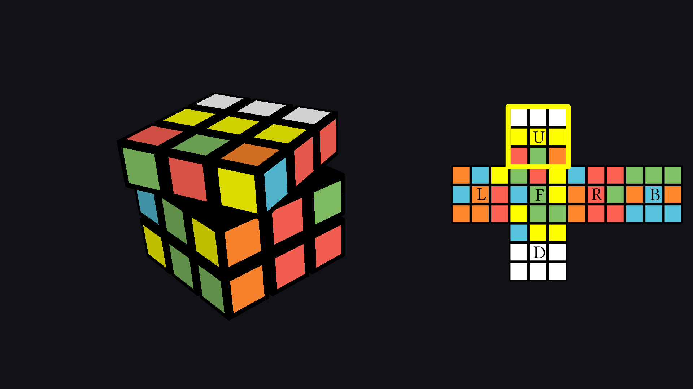
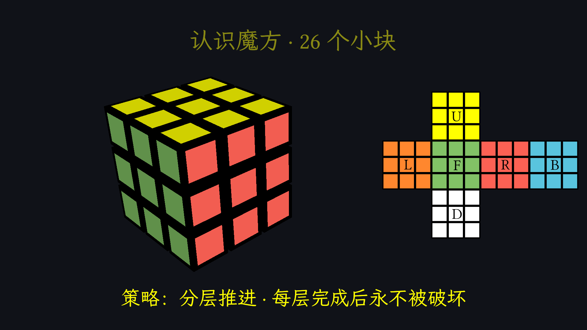
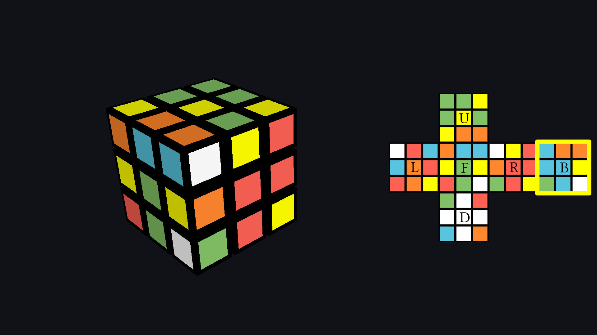
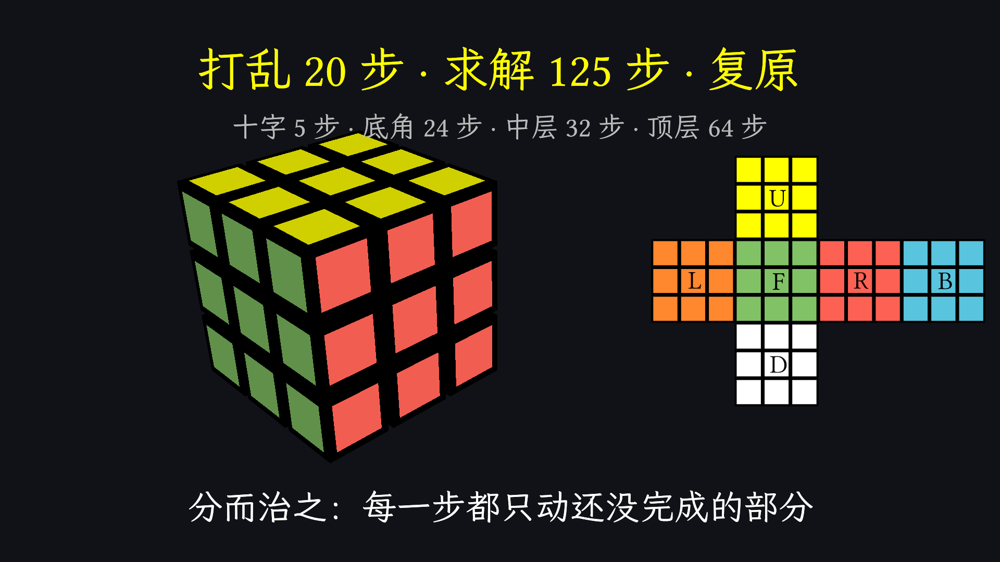

# rubiks_cube run1-glm53flash — 层先法求解:3D 魔方与展开图同步演示

> 面向 `topics/rubiks_cube/prompt.md` 的第一个正式 one-shot 交付。
> 结构化元数据见 [meta.toml](meta.toml);本 README 只做叙述与展开。

## 1. 效果图



`preview.png` 是全片信息密度最高的门面帧(`t ≈ 66s`,中层棱块插入进行中:
3D 魔方、展开图、金色当前面高亮框与阶段标题同屏)。来源命令:

```bash
ranim output rubiks_cube --example rubiks_cube
```

另附 capture(均为 `TimeMark::Capture` 在精确时间点自动落盘):

-  `t ≈ 8s`:开场自转 + 标题与状态数
-  `t ≈ 23s`:认识魔方——面字母 U R F D L B 标定
-  `t ≈ 37s`:20 步打乱完成,两个视图同步
-  `t ≈ 45s`:白色十字完成(阶段 1 结束的精确边界)
-  `t ≈ 120s`:复原完成 + 收尾统计

## 2. 原始 Prompt

> 创建一个 example 演示一个完整的魔方求解过程，要包括 3d 的魔方，以及平面展开图。

位置:`topics/rubiks_cube/prompt.md`(逐字引用,无附件)。

## 3. 设计与实现思路

### 知识整理与叙事设计

受众假设:具备基础计算机素养、但对魔方求解零了解。类比先行:
**"不拆魔方,只按规则转;分区推进,已完成的区域永不被破坏"——分而治之**。

叙事弧线(全片 120s,由求解器输出的真实 move 序列驱动,不为凑时长注水):

1. **钩子**(0–10s):复原态魔方整体自转一周,标题 + 状态数
   "4.3 × 10¹⁹ 种可能状态 · 只有 1 种是复原"。
2. **心智模型**(10–25s):认识 26 个小块——6 中心(永不动)/ 12 棱(两色)/
   8 角(三色);展开图上标定 U R F D L B 面记号;点出策略"分层推进"。
3. **打乱**(25–37s):种子固定的 xorshift 生成 20 步 HTM 打乱,3D 与展开图
   同步执行,金色高亮框跟随被转动的面。
4. **求解**(37–113s):四个阶段,每阶段先出阶段卡再播放真实求解动画;
   顶层再细分四个子步(黄十字 / 翻正角块 / 角块归位 / 棱块归位),各带子标题。
   动画速度随阶段递增(十字 0.62s/步 → 顶层 0.36s/步),前期慢以便看清。
5. **收尾**(113–120s):真实统计"打乱 20 步 · 求解 125 步 · 复原" +
   分阶段步数(十字 5 · 底角 24 · 中层 32 · 顶层 64,全部来自求解器输出),
   点题"分而治之:每一步都只动还没完成的部分"。

配色采用白底(U 黄)标准方案:层先法以白十字开局,与主流教学一致。

### 真实性实现

**屏幕上所有数字与所有转动都是真的。** 单一状态源:
`state[face][9]` 贴纸状态同时驱动 3D 魔方(26 个 `MeshItem` cubie 的刚体
旋转)与展开图(54 个 `VItem` 方块的贴纸置换,置换用同一套整型旋转数学
`rot90` 计算),两个视图结构上不可能不一致。

求解器与动画同文件内置,分两类搜索:

- **阶段 1–3(白十字 / 底层角 / 中层棱)**:在"被跟踪块"的抽象状态
  (每块 5 bit 槽位+朝向,打包进 u64)上做**双向 BFS**。目标集合包含
  全部已解块,因此每一步插入都**由构造保证**不破坏已完成区域;同面连续
  转动剪枝保持最短性。插入/弹出阶段把走法集合限制在 {U 三转 + 目标槽
  两个侧面}(初学者插入定理覆盖全部 case),失败才回退全 18 走法。
- **阶段 4(顶层)**:生成器 BFS——{U 三转} + 经典算法(OLL cross
  `F R U R' U' F'`、Sune、A perm、Ua perm)各作为一个生成器节点,搜索
  极小;四个生成器的行为(保持下层、只动声称的块)由单测逐个锁定。
  顶层的角块也被纳入跟踪与目标,杜绝"棱归位但角被 U 转带歪"的假解。

`cargo test` 断言(11 个用例):旋转数学已知映射、move 逆=恒等、贴纸
置换表与真实 move 一致性(`packed_transitions_match_real_moves`)、中心块
不动、块/槽表完备、四个 LL 生成器行为、随机打乱端到端求解
(debug 3 种子 + release 30 种子,含逐阶段不变量回放断言)、视频同款
种子的确定性冒烟。种子经 `seed_scan::scan_seeds` 工具(默认 `#[ignore]`)
筛选:0x7b 的解全阶段非零、节奏均衡。

### 关键实现路径

- 单 `#[scene]`,一个 `AnimStack`;每个物件组(26 cubie + 54 贴纸 + 文本组 +
  高亮框)各持一条全生命周期 `AnimSequence`,由 `Timeline` 结构统一推进
  (`hold` / `turn` / `text`),幕间不整幕淡出而是逐组 fade,共享时钟精确对齐。
- 面转动 = 自定义 `Eval`(`CubieTurn`):对转动层 9 个 cubie 的 `Rigid`
  做轴角旋转;展开图贴纸在转动末段 40% 时间做颜色 morph。
- 文本走 `typst_svg → SvgItem → Vec<VItem>` 直接编译,**绕开**
  `TypstText::new`——本 pin 的该构造函数把源串**字节数**与字形数做断言,
  任何非 ASCII(含全部中文)必然 panic(见迭代记录 #3)。
- 所有平面文字/面字母/高亮框按相机基 `from_cols(right, up, …)` billboard
  到与展开图相同的屏幕对齐平面;透视相机下不 billboard 的平面文字会呈
  45° 方位角旋转(见迭代记录 #4)。
- 中文渲染依赖 fontdb 能扫到的字体目录:Nix 用户的字体在
  `/etc/profiles/...`,需软链进 `~/.local/share/fonts`(HarmonyOS Sans SC)
  才能被 typst 的系统字体扫描命中(见迭代记录 #2)。

## 4. 迭代过程(渲染 + 视觉检查记录)

- **第 1 轮** `ranim render`(120.27s,1920x1080@60,~3min):
  抽帧 24 张全检。
  - #1 渲染即崩:`TypstText::new` 断言 字节数(26)≠ 字形数(9)。
    根因:该 pin 的断言用 `String::len()`(字节)对比字形数,非 ASCII
    必炸 → 绕过 `TypstText`,直接 `typst_svg → SvgItem → Vec<VItem>`。
  - #2 中文全部丢失字形:typst 的 fontdb 扫描 `~/.local/share/fonts`
    等标准目录,Nix 字体目录不在其中 → 软链 HarmonyOS Sans SC 后命中。
  - #3 全部文字 180° 颠倒且 45° 倾斜:文字躺在世界 XY 平面,透视相机
    从 45° 方位角观看所致 → 全部 billboard 到相机对齐平面。
  - #4 金色高亮框渲染成"V 形折线"而非方框:同一 unbilled 根因。
  - 另确认:3D 与展开图由同一状态驱动, 中层采样帧的颜色差异是 morph
    中间态,非 bug(密集抽帧 47.0–47.9s 验证 3D 转动正常)。
- **第 2 轮**(~3min):billboard 修复生效——标题/副标题/面字母端正可读,
  高亮框为正方框。新问题:
  - #5 右侧长文案全部超出画幅右缘被裁切(阶段卡、outro 统计等):
    透视相机下右侧可写宽度不足 → 全部长文案移到画面中轴
    (top/bottom center)。
  - #6 收尾语与统计行重叠:收尾语移至底部居中。
- **第 3 轮**(~3min):布局全部就位,24 帧全检无新问题;
  确认 3D/展开图在各 move 边界 capture 上逐贴纸一致。
- **第 4 轮(终版)** `ranim output`:成片 + 6 张 capture 落盘,全片
  24 帧复检 + 全部 capture 时点复核,零新问题。
- **补充修复(终版前)**:渲染管线 D0002 panic——两条根因:
  (a) 开场自转里 cubie 序列被推入 5s 动画后又参与全局 hold,内容组比
  时间线长 5 秒;(b) 文本序列在创建时已自带完整生命周期,但全局 hold
  仍向其追加死时间(最长把场景撑到 134s)。相机结束后还有内容的帧会
  因"零相机"直接中止渲染。修复:自转期间 cubie 不参与全局 hold;文本
  序列独立存放不再被推进;相机与内容统一在 total+1.5s 收束(片尾定格)。
  新增回归测试 `every_rendered_frame_has_exactly_one_camera` 锁死该不变量。

## 5. 验证情况

- 构建:`cargo check --all-targets` / `cargo clippy --all-targets`
  (0 warning)/ `cargo fmt` 全绿,typst feature 启用。
- 测试:11 个用例(10 常规 + 1 个默认 ignore 的种子筛选工具),
  debug 与 release 均通过;release 含 30 个随机种子的端到端求解。
- 渲染:`ranim output rubiks_cube --example rubiks_cube`,121.89s,
  1920x1080@60fps,mp4(H.264)。
- 视觉检查:三轮全片抽帧(每轮 24 时点)+ 终版全片复检与全部 capture
  时点复核;累计 ~80 个时点。
- 环境备注:渲染机 NVIDIA RTX 4070 Ti SUPER(Vulkan);nix develop 内
  固定工具链 nightly-2026-08-01 + ranim-cli 0.2.1 + ffmpeg 8.1。

## 6. 环境

模型 / harness / 协议 / pin 等事实性信息以 [meta.toml](meta.toml) 为准。
ranim pin `40d15be6`(与根 flake 一致,未 bump);协议基点
`base@7b48199`,运行分支 `rubiks_cube-run1-glm53flash`。
